# ER Diagram (Mermaid)

This diagram renders automatically on GitHub and in VS Code (with a Mermaid extension), and can be pasted into [mermaid.live](https://mermaid.live) to view/export as an image. Edit the text below and the picture updates.

```mermaid
erDiagram
    %% ───────── The hub ─────────
    CATERER {
        uuid id PK
        string company_name
        string legal_name
        enum status "onboarding|active|paused|archived"
        datetime go_live_at
    }

    %% ───────── PostgreSQL (the only SQL model) ─────────
    CATERER_BANKING {
        uuid id PK
        uuid caterer_id FK "→ caterer (cross-DB)"
        string bic_swift
        bytea iban_encrypted "AES-256"
        bytea account_number_encrypted "AES-256"
        uuid rib_document_id FK
    }

    CATERER_ONBOARDING_FILE {
        uuid id PK
        uuid caterer_id FK
        enum profile_status
        enum banking_status
        enum golive_status "not_ready|ready|approved"
    }
    USER {
        uuid id PK
        uuid caterer_id FK
        string email
        enum role
    }
    ESTABLISHMENT {
        uuid id PK
        uuid caterer_id FK
        enum type "school|daycare|camp|css"
        uuid css_district_id FK "self → css"
        enum status
    }
    CLOSURE {
        uuid id PK
        uuid caterer_id FK
        uuid establishment_id FK
        date date
    }
    MENU {
        uuid id PK
        uuid caterer_id FK
        uuid establishment_id FK
        enum type "school|daycare|camp"
        enum status
        array schedule "embedded"
    }
    DISH {
        uuid id PK
        uuid caterer_id FK
        int price_cents
        array allergens "embedded"
    }
    DOCUMENT {
        uuid id PK
        uuid caterer_id FK
        string category
        enum status
        enum visibility
        uuid version_of FK "self"
    }
    CONTRACT {
        uuid id PK
        uuid caterer_id FK
        enum type
        enum status
        uuid signed_document_id FK
        array signature_requests "embedded"
    }
    MODULE {
        uuid id PK
        string key
        enum type "commercial|infrastructure"
    }
    CATERER_MODULE {
        uuid id PK
        uuid caterer_id FK
        uuid module_id FK
        enum status "active|inactive"
        int monthly_price_cents
    }
    VALIDATION_ITEM {
        uuid id PK
        uuid caterer_id FK
        enum type
        enum status
        enum source_db "mongo|postgres"
        uuid source_record_id "→ banking when postgres"
    }
    CORRECTION {
        uuid id PK
        uuid caterer_id FK
        uuid validation_item_id FK
        uuid ecoloop_ticket_id FK
        enum status
    }
    GOLIVE_CHECKLIST_ITEM {
        uuid id PK
        uuid caterer_id FK
        string requirement
        enum status "complete|incomplete|blocked|waived"
    }
    ECOLOOP_TICKET {
        uuid id PK
        uuid caterer_id FK
        enum status
        bool blocks_golive
    }
    ECOLOOP_MESSAGE {
        uuid id PK
        uuid ticket_id FK
        enum type "incl. internal_note (hidden from caterer)"
    }
    SMART_IMPORT_JOB {
        uuid id PK
        uuid caterer_id FK
        uuid source_document_id FK
        enum status
        array fields "embedded"
    }
    REPORT_SCHEDULE {
        uuid id PK
        uuid caterer_id FK
        string report_type
    }
    AUDIT_LOG {
        uuid id PK
        uuid caterer_id FK
        string entity_type
        string action
    }

    %% ───────── Relationships ─────────
    CATERER ||--|| CATERER_BANKING : "1:1 · Postgres"
    CATERER ||--|| CATERER_ONBOARDING_FILE : "1:1"
    CATERER ||--o{ USER : has
    CATERER ||--o{ ESTABLISHMENT : has
    CATERER ||--o{ MENU : has
    CATERER ||--o{ DISH : has
    CATERER ||--o{ DOCUMENT : has
    CATERER ||--o{ CONTRACT : has
    CATERER ||--o{ CATERER_MODULE : has
    CATERER ||--o{ VALIDATION_ITEM : has
    CATERER ||--o{ CORRECTION : has
    CATERER ||--o{ GOLIVE_CHECKLIST_ITEM : has
    CATERER ||--o{ ECOLOOP_TICKET : has
    CATERER ||--o{ SMART_IMPORT_JOB : has
    CATERER ||--o{ REPORT_SCHEDULE : has
    CATERER ||--o{ AUDIT_LOG : has

    ESTABLISHMENT ||--o{ CLOSURE : has
    ESTABLISHMENT ||--o{ ESTABLISHMENT : "school → CSS"
    MENU }o--o{ ESTABLISHMENT : "applies to (pending)"
    MENU }o--o{ DISH : "schedule uses"
    MENU }o--o| SMART_IMPORT_JOB : "filled by"

    DOCUMENT ||--o{ DOCUMENT : "new version of"
    DOCUMENT }o--o| SMART_IMPORT_JOB : "read by"
    CATERER_BANKING }o--|| DOCUMENT : "RIB/stmt/auth · cross-DB"

    CONTRACT }o--o| DOCUMENT : "signed PDF"
    CATERER_MODULE }o--|| MODULE : "instance of"

    VALIDATION_ITEM }o--o| DOCUMENT : "about"
    VALIDATION_ITEM }o--o| SMART_IMPORT_JOB : "about"
    VALIDATION_ITEM }o--o| CATERER_BANKING : "banking · cross-DB"
    CORRECTION }o--|| VALIDATION_ITEM : "from"
    CORRECTION ||--|| ECOLOOP_TICKET : "discussed in"
    ECOLOOP_TICKET ||--o{ ECOLOOP_MESSAGE : "thread"
    SMART_IMPORT_JOB }o--|| DOCUMENT : "source"
```

> **Legend:** `||--||` one-to-one · `||--o{` one-to-many · `}o--o{` many-to-many · "embedded" = stored inside the parent document · "cross-DB" = link spans PostgreSQL ↔ MongoDB (no foreign key; checked in code).
